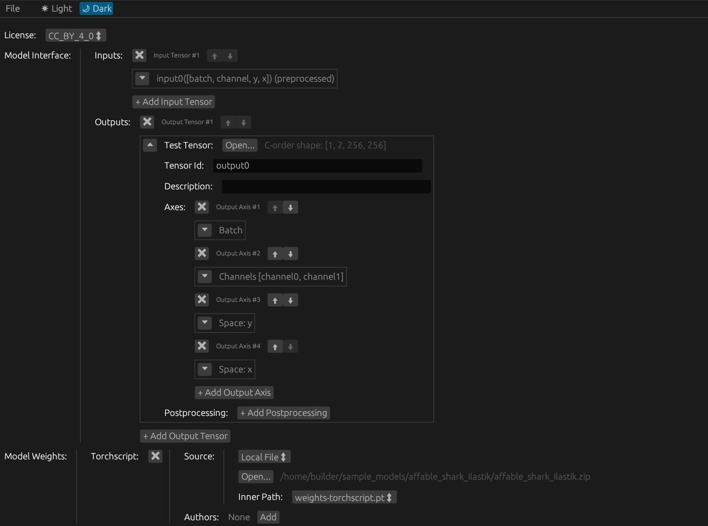

# bioimg_gui

A graphical user application for creating [bioimage models](https://github.com/bioimage-io/spec-bioimage-io)

#  Running the application

## Using a precompiled executable

- Get a precompiled executable for your platform of choice (Windows, Linux or Mac) in the [releases](https://github.com/kreshuklab/bioimg_rs/releases) page;
- Unzip the zip archive;
- and just execute the extracted file

## Compiling and running from source
- [Install rust and cargo](https://www.rust-lang.org/tools/install)
- clone the root repo: `git clone https://github.com/kreshuklab/bioimg_rs bioimg_rs`
- cd into the cloned repo `cd bioimg_rs`
- execute `cargo run`